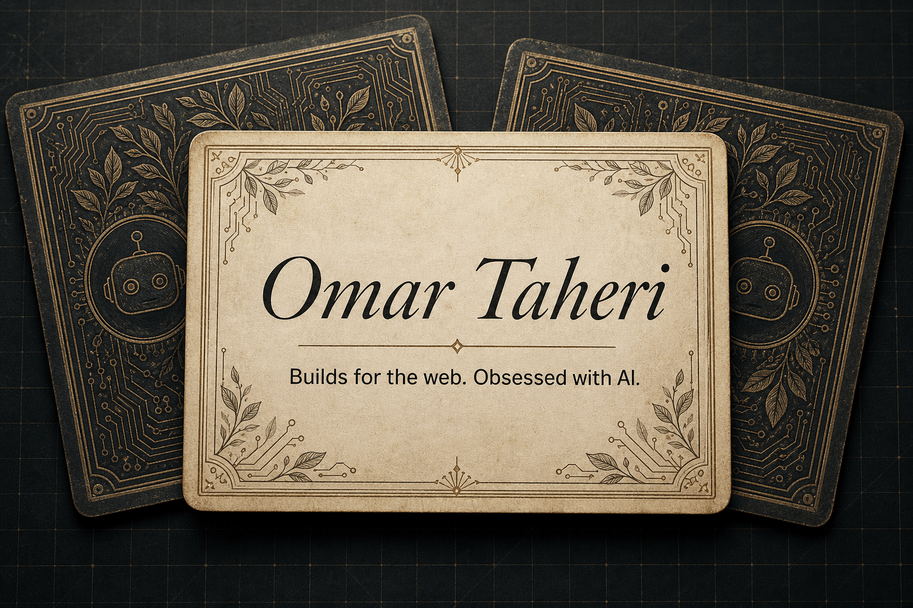

# Omar's Digital Deck

A collectible-card portfolio about the things I build, learn, break, and
occasionally manage to keep online.

[](./public/showcase.mp4)

**[▶ Watch the portfolio showcase](./public/showcase.mp4)**

## One more portfolio — this time, for real

I've built this website many times. Seriously, *many* times.

Every version said the right things, but none of them quite felt like me. This
time I stopped trying to build the Serious Portfolio™ and made a small corner of
the web I would actually want to explore: cards, stickers, stories, experiments,
and a little controlled chaos.

I guess this is the better time. I have better tools, clearer taste, and more
stories worth telling. More importantly, this version finally feels playful,
honest, and mine.

## What's in the deck?

- My story, from Larache and a first freelance gig at twelve to studying
  computer science at Al Akhawayn University.
- Projects across AI, robotics, web development, automation, and
  infrastructure.
- A tactile stack of movable cards and draggable stickers, built for mouse,
  touch, and keyboard.
- Light and dark themes, because choosing just one felt unnecessarily cruel.
- Markdown-backed project pages, because even playful websites deserve tidy
  content.

## Built with

Next.js 16 · React 19 · TypeScript · vinext · Cloudflare Workers

## Run it locally

You'll need Node.js 22.13 or newer.

```bash
npm install
npm run dev
```

Then open <http://localhost:3000>.

For a production build and the test suite:

```bash
npm run build
npm test
```

## The previous version

The portfolio that used to live in this repository is still available in
[`archive/old-portfolio`](./archive/old-portfolio). It earned a quiet retirement
instead of a dramatic deletion.

## Still evolving

This deck is live, but never really finished. I'll keep adding cards as I build
new things — and I'll probably move a sticker or two when nobody is looking.
